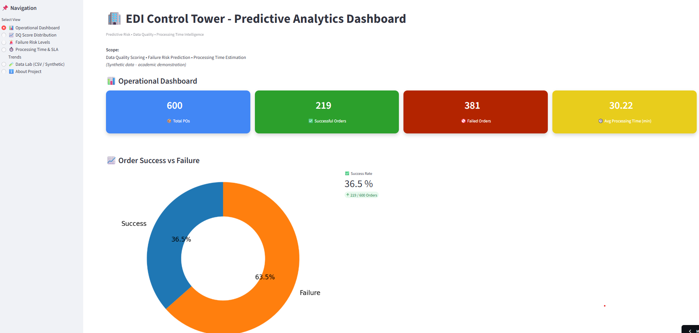
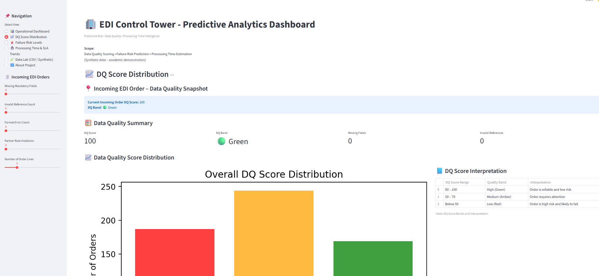
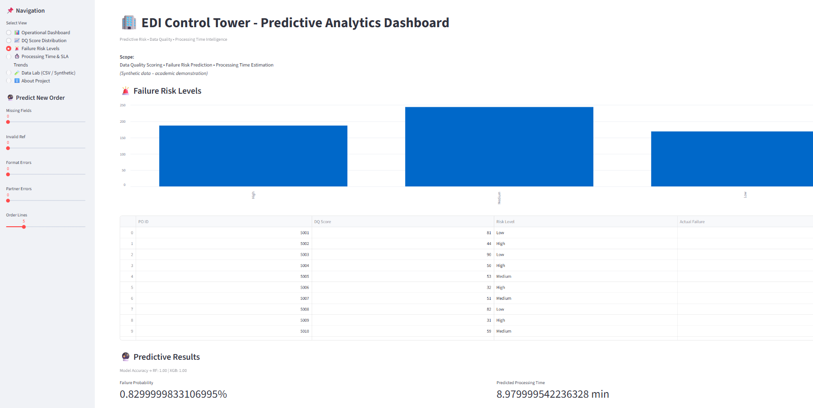
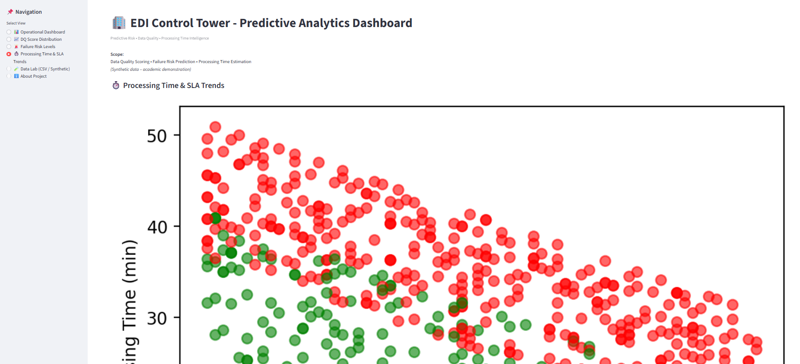
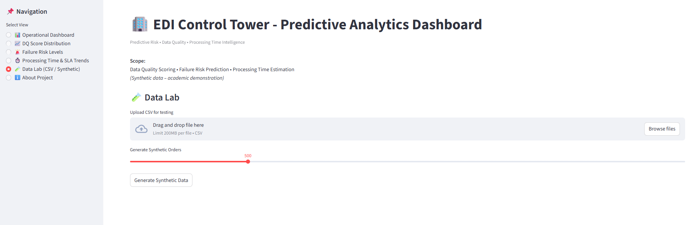

# 🏢 EDI Control Tower(edi-predictive-dashboard)
edi-predictive-dashboard
🏢 **EDI Control Tower**
Predictive Risk • Data Quality • Processing Time Intelligence
📌 Project Overview

EDI Control Tower is an intelligent analytics dashboard built using Streamlit + Machine Learning to monitor and predict the reliability of Electronic Data Interchange (EDI) order processing.
The system transforms raw operational data into:
Data Quality scores
Failure probability predictions
Processing time forecasts
SLA risk indicators
Actionable operational insights
It enables organizations to move from:
Reactive issue handling → Proactive risk prevention

## 📊 Dashboard Preview

### Operational Dashboard

### DQ Distribution

### Risk Prediction

### Prediction

### Data Lab

🎯 **Problem Statement**
Traditional EDI processing systems:
detect failures after they occur
lack early warning signals
have limited visibility into data quality
cause SLA breaches and manual rework

**Goal**
Build a predictive dashboard that:
✅ detects bad orders early
✅ predicts failure risk
✅ estimates processing delays
✅ provides operational control tower visibility

🏗 **System Architecture**
User (Browser)
      ↓
Streamlit UI
      ↓
Data Processing (Pandas / NumPy)
      ↓
ML Models (RF + XGBoost)
      ↓
Predictions & Visualizations

🧩 **Technology Stack**
| Layer      | Technology              |
| ---------- | ----------------------- |
| Frontend   | Streamlit               |
| Language   | Python                  |
| Data       | Pandas, NumPy           |
| ML         | RandomForest, XGBoost   |
| Charts     | Matplotlib              |
| Deployment | Streamlit Cloud / Local |

⚙️ **Application Flow (High Level)**

Generate or load dataset
Compute Data Quality metrics
Train ML models (cached)
User selects dashboard page
Predictions generated in real time
Insights displayed visually

📂 **Code Walkthrough (Module by Module)**
🔹** 1.Import **
import streamlit as st
import pandas as pd
import numpy as np
import matplotlib.pyplot as plt

**Purpose**
UI rendering
data manipulation
visualization
ML processing

🔹 **2. Page Configuration**
st.set_page_config(layout="wide")
Purpose
Wide layout for dashboard feel
Improves KPI card spacing

🔹 **3. Styling (CSS Cards)**
st.markdown("", unsafe_allow_html=True)
Purpose
Creates:
KPI cards
colors
rounded borders
shadows

🔹 **4. Sidebar Navigation**
page = st.sidebar.radio(...)
Purpose
Implements multi-page behavior:
| Page                  | Function              |
| --------------------- | --------------------- |
| Operational Dashboard | KPIs                  |
| DQ Score              | Data quality analysis |
| Failure Risk          | ML predictions        |
| Processing Time       | SLA trends            |
| Data Lab              | Test CSV              |
| About                 | Documentation         |

🔹 **5. Synthetic Dataset Generation**
data = pd.DataFrame({...})
| Column              | Description         |
| ------------------- | ------------------- |
| dq_score            | Data quality score  |
| missing             | missing fields      |
| invalid_ref         | invalid references  |
| format_err          | format issues       |
| partner_err         | partner rule errors |
| order_lines         | complexity          |
| order_failed        | failure label       |
| processing_time_min | regression target   |
Why Synthetic Data?

Used to:
simulate real EDI orders
allow ML training
demonstrate functionality
Can be replaced with real production logs.

🔹 **6. Model Training (Core Intelligence)**
@st.cache_resource
def train_models(data):
Why cache?
Model training is heavy.
Caching ensures:
trained once
reused across page refresh
faster app

**Models Used**
1️⃣ Random Forest (Classification)
Predicts order_failed
2️⃣ XGBoost Classifier
Higher accuracy failure prediction
3️⃣ XGBoost Regressor
Predicts processing_time_min

**Output**
return rf, xgb, time_model, rf_acc, xgb_acc
Used later for:
predictions
accuracy display

🔹 **7. Page Features Explained**
📊 Operational Dashboard

Shows KPIs:
Total POs
Successful
Failed
Avg Processing Time
Benefit
Quick executive summary of system health.

📈 **DQ Score Distribution**
Features
live DQ score calculator
quality band classification
distribution chart
Benefit
Identify poor quality orders before processing.

🚨 **Failure Risk Levels (ML)**
Workflow
User enters order parameters
Features built
Models predict:
failure probability
expected time

fail_prob = xgb_model.predict_proba(input_df)[0][1]
pred_time = time_model.predict(input_df)[0]

Output
Probability %
Time estimate
Risk alert
Benefit
Proactive exception handling.

⏱ Processing Time Trends
Scatter plot:
DQ Score vs Processing Time
Insight
Low quality → higher processing time.

🧪 Data Lab
Allows:
CSV upload
synthetic data generation
Benefit
Testing and experimentation.

ℹ️ About Page
Provides:
purpose
architecture
modeling
business value

Useful for:
GitHub readers
interviewers
stakeholders

🧠 **Machine Learning Strategy**
Classification
**Predict:**
Will order fail?

**Target:**
order_failed (0/1)

**Metric:**
Accuracy
Regression
**Predict:**
How long will order take?

**Target:**
processing_time_min

**Metric:**
MAE / RMSE (extendable)

| Benefit                 | Impact              |
| ----------------------- | ------------------- |
| Early failure detection | fewer escalations   |
| Time prediction         | better SLA planning |
| Data quality monitoring | fewer rejections    |
| Central visibility      | faster decisions    |
| Automation ready        | lower manual effort |

🚀 **Deployment**
Run locally
streamlit run app.py
Deploy
Streamlit Cloud
Azure App Service
Docker

🔮 **Future Enhancements**
Planned improvements:
SHAP explainability
real-time streaming
historical trend store
model retraining
SLA breach forecasting
alert notifications
database integration
dark theme UI

🎓 **Academic Context**

**Project:** Predictive Modeling and Data Quality Assurance for EDI Orders 
**Program:** BITS Pilani WILP 
**Author:** Ajitabh Tiwari 

**Demonstrates integration of:**
Data Engineering
Machine Learning
Business Analytics
Dashboarding
